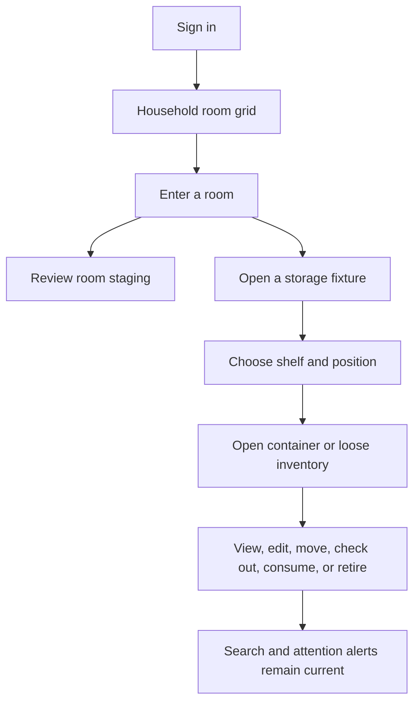
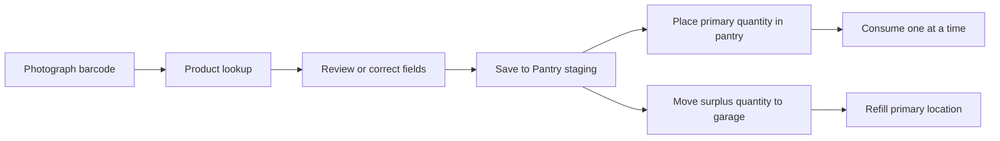

# Product Tour

GarageGrid is organized around a physical metaphor: enter a room, see its storage, open a location, and inspect what is there.

## Primary journey

### 1. Household and rooms

The landing experience presents user-defined rooms and areas such as a garage, pantry, kitchen, office, or closet. A room can be added later without disrupting existing inventory.

### 2. Room staging

Every room has a staging area. It represents the real place where groceries, moving boxes, tools, or newly photographed objects wait before final placement.

Staging supports rapid intake first and organization second—a deliberate choice that reduces the friction of starting an inventory.

### 3. Storage maps

A room may contain racks, refrigerators, freezers, carts, cabinets, closet organizers, workbenches, or custom layouts. Each fixture provides a visual map of independently configurable sections and positions.

### 4. Positions and containers

Opening a position reveals its smaller physical spaces. A position may contain:

- A labeled box, bin, basket, or tote
- A loose durable item
- A counted supply
- A shared-space list of individually identified objects

Containers can be opened to reveal and manage their contents.

### 5. Movement

Inventory can move:

- From room staging into a position or container
- From one rack to another
- From a fixture back to staging during reorganization
- Between rooms
- Between primary-use and surplus-storage locations

### 6. Checkout and return

A checked-out item retains its home location and a note such as “Master closet repair.” On return, the user can confirm the original location or relocate the item to a new permanent home.

### 7. Search and alerts

Household search returns separate results for similar items and shows their full physical path. Alerts surface expiration, upcoming expiration, restock, repair, and other attention states.

## Rapid grocery workflow

The intake workflow always allows human correction before a suggested identification becomes an inventory record.

## Mobile use

The responsive interface is intended for use while physically standing at a rack, pantry, or refrigerator. Mobile sections use progressive disclosure so high-frequency actions remain easy to reach while detailed fields stay available when needed.
