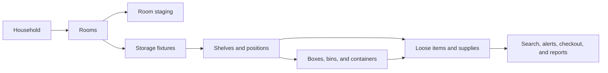

# GarageGrid

*A privacy-first household inventory and storage-management product designed around the way real homes are organized.*

> **Presentation-only portfolio repository.** Application source code, household data, credentials, database schema, deployment configuration, and private photographs remain private.

## Product overview

GarageGrid helps a household answer practical questions such as:

- Where is an item stored?
- What is inside a particular box or bin?
- Who checked an item out, and where are they using it?
- Which food or household supplies are expiring, depleted, or stored as surplus?
- What documentation is available for insurance, warranty, or replacement purposes?

The product models a home spatially—from rooms, staging areas, and storage fixtures down to shelves, positions, containers, and individual inventory records.

## Core capabilities

- User-defined rooms, closets, and storage locations
- Per-room staging for new purchases, moving, and organization
- Visual maps for racks, carts, freezers, refrigerators, cabinets, and custom grids
- Stable database identities with editable human-friendly names and labels
- Position → container → item drill-down
- Individually tracked objects and counted supplies
- Quantity splitting across a primary location and surplus storage
- Checkout notes, return-to-original-location, and relocation workflows
- Household- and room-level search
- Barcode lookup and AI-assisted photo intake with human review before saving
- Acquired, opened, best-by, and expiration dates with attention alerts
- Mobile-friendly intake for use while standing at the physical storage location
- Receipt, model, serial-number, warranty, and insurance-documentation direction

## Representative workflow

A household brings home a 12-can case of black beans:

1. Scan or enter the product once in Pantry staging.
2. Confirm the suggested product details and quantity.
3. Place four cans in the pantry's primary-use bin.
4. Move eight cans to Garage staging for surplus storage.
5. Consume one can at a time while preserving accurate quantities at each location.
6. Receive restock or “refill primary location” guidance when thresholds are reached.

This workflow illustrates a key design principle: one product identity can have quantities distributed across multiple physical locations without losing inventory clarity.

## Product decisions and edge cases

GarageGrid was shaped through real household scenarios, including:

- Similar food packages acquired on different dates with different expiration dates
- Shelves whose positions have different capacity and geometry
- Large loose items that occupy a shelf area while smaller items sit around them
- Boxes that are labeled informally but retain permanent internal identities
- New rooms and closets added later without restructuring the database
- Containers that can be explicitly marked open or full
- Items removed because they were consumed, sold, broken, or disposed
- Multiple similar tools that still require separate identities and histories

## Role and collaboration

Valerie defined the product vision, domain model, workflows, acceptance criteria, edge cases, and usability priorities, and conducted iterative desktop and mobile testing.

Implementation was developed through AI-assisted engineering collaboration, with hands-on user acceptance testing used to identify navigation, responsive-layout, data-model, and workflow improvements.

## Technology overview

The private implementation uses:

- Next.js and TypeScript
- Prisma and PostgreSQL
- Docker-based local deployment
- Responsive web interfaces for desktop, tablet, and phone
- Local-network access designed for a private household

Technical specifics, source code, schema details, credentials, and deployment configuration are intentionally excluded from this repository.

## Explore the case study

- [Product tour](PRODUCT_TOUR.md)
- [Design decisions](DESIGN_DECISIONS.md)
- [Security and privacy](SECURITY_AND_PRIVACY.md)

## Current status

GarageGrid 2.0 is an actively tested reconstruction of an earlier prototype. The current focus is completing core household workflows, validating mobile use in real storage spaces, and preserving a clean, extensible data foundation.

There is no public live demo because the working application is intentionally self-hosted and private.
